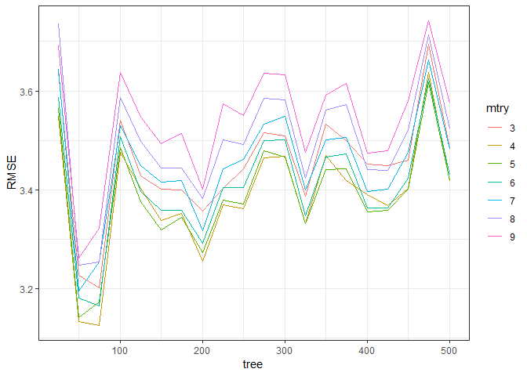
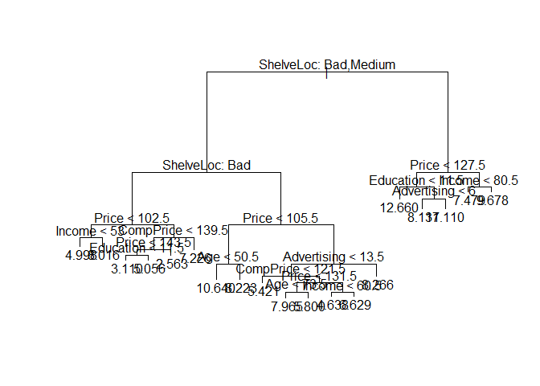
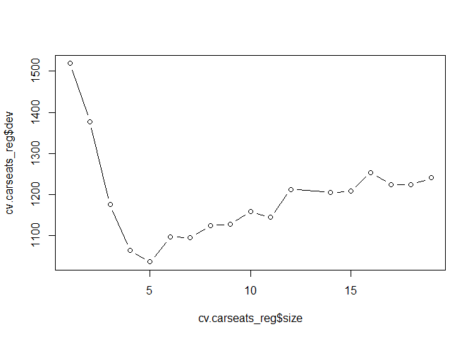
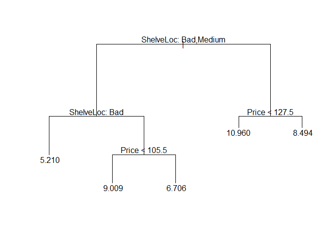

Homework 4: Bags, Forests, Boosts, oh my
================
Max Mershon
3/5/2019

Problem 1
---------

Problem 7 from Chapter 8 in the text. To be specific, please use a sequence of `ntree` from 25 to 500 in steps of 25 and `mtry` from 3 to 9 for by 1.

Answer 1
--------

``` r
set.seed(123)
df <- tbl_df(Boston)
inTraining <- createDataPartition(df$medv, p = .75, list = F)
training <- df[inTraining, ]
testing  <- df[-inTraining, ]
```

``` r
n.trees = seq(25, 500, by = 25)
results_final = data.frame(mtry = numeric(), RMSE = numeric(), tree = numeric())

for(x in n.trees){
  rf_boston <- train(medv ~ ., 
                        data = training,
                        method = "rf",
                        ntree = x,
                        importance = T,
                        tuneGrid = data.frame(mtry = 3:9))
  
  results <- rf_boston$results[1:2]
  results$tree = x
  results_final <- rbind(results_final, results)
}

results_final
```

    ##     mtry     RMSE tree
    ## 1      3 3.638476   25
    ## 2      4 3.548722   25
    ## 3      5 3.563827   25
    ## 4      6 3.586359   25
    ## 5      7 3.643329   25
    ## 6      8 3.735363   25
    ## 7      9 3.690845   25
    ## 8      3 3.225852   50
    ## 9      4 3.133277   50
    ## 10     5 3.140505   50
    ## 11     6 3.180299   50
    ## 12     7 3.194100   50
    ## 13     8 3.246544   50
    ## 14     9 3.261535   50
    ## 15     3 3.200394   75
    ## 16     4 3.125711   75
    ## 17     5 3.171911   75
    ## 18     6 3.164197   75
    ## 19     7 3.253425   75
    ## 20     8 3.253403   75
    ## 21     9 3.322073   75
    ## 22     3 3.540817  100
    ## 23     4 3.475378  100
    ## 24     5 3.485157  100
    ## 25     6 3.507434  100
    ## 26     7 3.529841  100
    ## 27     8 3.586306  100
    ## 28     9 3.636520  100
    ## 29     3 3.428580  125
    ## 30     4 3.401834  125
    ## 31     5 3.376017  125
    ## 32     6 3.396259  125
    ## 33     7 3.448117  125
    ## 34     8 3.497622  125
    ## 35     9 3.546882  125
    ## 36     3 3.401270  150
    ## 37     4 3.337138  150
    ## 38     5 3.319016  150
    ## 39     6 3.358485  150
    ## 40     7 3.414722  150
    ## 41     8 3.443848  150
    ## 42     9 3.492441  150
    ## 43     3 3.399405  175
    ## 44     4 3.351424  175
    ## 45     5 3.344269  175
    ## 46     6 3.358080  175
    ## 47     7 3.419213  175
    ## 48     8 3.443896  175
    ## 49     9 3.514071  175
    ## 50     3 3.356389  200
    ## 51     4 3.255707  200
    ## 52     5 3.271919  200
    ## 53     6 3.291577  200
    ## 54     7 3.316455  200
    ## 55     8 3.381175  200
    ## 56     9 3.400966  200
    ## 57     3 3.402020  225
    ## 58     4 3.369717  225
    ## 59     5 3.379102  225
    ## 60     6 3.403984  225
    ## 61     7 3.442924  225
    ## 62     8 3.501012  225
    ## 63     9 3.574190  225
    ## 64     3 3.442814  250
    ## 65     4 3.361684  250
    ## 66     5 3.370806  250
    ## 67     6 3.403942  250
    ## 68     7 3.461169  250
    ## 69     8 3.490918  250
    ## 70     9 3.549588  250
    ## 71     3 3.515193  275
    ## 72     4 3.465146  275
    ## 73     5 3.478078  275
    ## 74     6 3.499517  275
    ## 75     7 3.531902  275
    ## 76     8 3.585072  275
    ## 77     9 3.636100  275
    ## 78     3 3.509277  300
    ## 79     4 3.468203  300
    ## 80     5 3.465748  300
    ## 81     6 3.501332  300
    ## 82     7 3.548350  300
    ## 83     8 3.581565  300
    ## 84     9 3.632164  300
    ## 85     3 3.387402  325
    ## 86     4 3.330439  325
    ## 87     5 3.331332  325
    ## 88     6 3.346524  325
    ## 89     7 3.398874  325
    ## 90     8 3.423967  325
    ## 91     9 3.475560  325
    ## 92     3 3.532495  350
    ## 93     4 3.469456  350
    ## 94     5 3.441134  350
    ## 95     6 3.465459  350
    ## 96     7 3.501202  350
    ## 97     8 3.561188  350
    ## 98     9 3.591527  350
    ## 99     3 3.498838  375
    ## 100    4 3.418640  375
    ## 101    5 3.441860  375
    ## 102    6 3.472570  375
    ## 103    7 3.506449  375
    ## 104    8 3.572164  375
    ## 105    9 3.614770  375
    ## 106    3 3.451794  400
    ## 107    4 3.389734  400
    ## 108    5 3.355208  400
    ## 109    6 3.362388  400
    ## 110    7 3.395628  400
    ## 111    8 3.439993  400
    ## 112    9 3.474332  400
    ## 113    3 3.448109  425
    ## 114    4 3.367927  425
    ## 115    5 3.357811  425
    ## 116    6 3.363586  425
    ## 117    7 3.401334  425
    ## 118    8 3.439249  425
    ## 119    9 3.478930  425
    ## 120    3 3.460383  450
    ## 121    4 3.402445  450
    ## 122    5 3.401208  450
    ## 123    6 3.423555  450
    ## 124    7 3.475129  450
    ## 125    8 3.520323  450
    ## 126    9 3.580876  450
    ## 127    3 3.694251  475
    ## 128    4 3.637723  475
    ## 129    5 3.616431  475
    ## 130    6 3.624659  475
    ## 131    7 3.662165  475
    ## 132    8 3.712852  475
    ## 133    9 3.741642  475
    ## 134    3 3.483595  500
    ## 135    4 3.417473  500
    ## 136    5 3.418139  500
    ## 137    6 3.429144  500
    ## 138    7 3.481819  500
    ## 139    8 3.523810  500
    ## 140    9 3.576146  500

``` r
results_final$mtry <- as.character(results_final$mtry)
results_final
```

    ##     mtry     RMSE tree
    ## 1      3 3.638476   25
    ## 2      4 3.548722   25
    ## 3      5 3.563827   25
    ## 4      6 3.586359   25
    ## 5      7 3.643329   25
    ## 6      8 3.735363   25
    ## 7      9 3.690845   25
    ## 8      3 3.225852   50
    ## 9      4 3.133277   50
    ## 10     5 3.140505   50
    ## 11     6 3.180299   50
    ## 12     7 3.194100   50
    ## 13     8 3.246544   50
    ## 14     9 3.261535   50
    ## 15     3 3.200394   75
    ## 16     4 3.125711   75
    ## 17     5 3.171911   75
    ## 18     6 3.164197   75
    ## 19     7 3.253425   75
    ## 20     8 3.253403   75
    ## 21     9 3.322073   75
    ## 22     3 3.540817  100
    ## 23     4 3.475378  100
    ## 24     5 3.485157  100
    ## 25     6 3.507434  100
    ## 26     7 3.529841  100
    ## 27     8 3.586306  100
    ## 28     9 3.636520  100
    ## 29     3 3.428580  125
    ## 30     4 3.401834  125
    ## 31     5 3.376017  125
    ## 32     6 3.396259  125
    ## 33     7 3.448117  125
    ## 34     8 3.497622  125
    ## 35     9 3.546882  125
    ## 36     3 3.401270  150
    ## 37     4 3.337138  150
    ## 38     5 3.319016  150
    ## 39     6 3.358485  150
    ## 40     7 3.414722  150
    ## 41     8 3.443848  150
    ## 42     9 3.492441  150
    ## 43     3 3.399405  175
    ## 44     4 3.351424  175
    ## 45     5 3.344269  175
    ## 46     6 3.358080  175
    ## 47     7 3.419213  175
    ## 48     8 3.443896  175
    ## 49     9 3.514071  175
    ## 50     3 3.356389  200
    ## 51     4 3.255707  200
    ## 52     5 3.271919  200
    ## 53     6 3.291577  200
    ## 54     7 3.316455  200
    ## 55     8 3.381175  200
    ## 56     9 3.400966  200
    ## 57     3 3.402020  225
    ## 58     4 3.369717  225
    ## 59     5 3.379102  225
    ## 60     6 3.403984  225
    ## 61     7 3.442924  225
    ## 62     8 3.501012  225
    ## 63     9 3.574190  225
    ## 64     3 3.442814  250
    ## 65     4 3.361684  250
    ## 66     5 3.370806  250
    ## 67     6 3.403942  250
    ## 68     7 3.461169  250
    ## 69     8 3.490918  250
    ## 70     9 3.549588  250
    ## 71     3 3.515193  275
    ## 72     4 3.465146  275
    ## 73     5 3.478078  275
    ## 74     6 3.499517  275
    ## 75     7 3.531902  275
    ## 76     8 3.585072  275
    ## 77     9 3.636100  275
    ## 78     3 3.509277  300
    ## 79     4 3.468203  300
    ## 80     5 3.465748  300
    ## 81     6 3.501332  300
    ## 82     7 3.548350  300
    ## 83     8 3.581565  300
    ## 84     9 3.632164  300
    ## 85     3 3.387402  325
    ## 86     4 3.330439  325
    ## 87     5 3.331332  325
    ## 88     6 3.346524  325
    ## 89     7 3.398874  325
    ## 90     8 3.423967  325
    ## 91     9 3.475560  325
    ## 92     3 3.532495  350
    ## 93     4 3.469456  350
    ## 94     5 3.441134  350
    ## 95     6 3.465459  350
    ## 96     7 3.501202  350
    ## 97     8 3.561188  350
    ## 98     9 3.591527  350
    ## 99     3 3.498838  375
    ## 100    4 3.418640  375
    ## 101    5 3.441860  375
    ## 102    6 3.472570  375
    ## 103    7 3.506449  375
    ## 104    8 3.572164  375
    ## 105    9 3.614770  375
    ## 106    3 3.451794  400
    ## 107    4 3.389734  400
    ## 108    5 3.355208  400
    ## 109    6 3.362388  400
    ## 110    7 3.395628  400
    ## 111    8 3.439993  400
    ## 112    9 3.474332  400
    ## 113    3 3.448109  425
    ## 114    4 3.367927  425
    ## 115    5 3.357811  425
    ## 116    6 3.363586  425
    ## 117    7 3.401334  425
    ## 118    8 3.439249  425
    ## 119    9 3.478930  425
    ## 120    3 3.460383  450
    ## 121    4 3.402445  450
    ## 122    5 3.401208  450
    ## 123    6 3.423555  450
    ## 124    7 3.475129  450
    ## 125    8 3.520323  450
    ## 126    9 3.580876  450
    ## 127    3 3.694251  475
    ## 128    4 3.637723  475
    ## 129    5 3.616431  475
    ## 130    6 3.624659  475
    ## 131    7 3.662165  475
    ## 132    8 3.712852  475
    ## 133    9 3.741642  475
    ## 134    3 3.483595  500
    ## 135    4 3.417473  500
    ## 136    5 3.418139  500
    ## 137    6 3.429144  500
    ## 138    7 3.481819  500
    ## 139    8 3.523810  500
    ## 140    9 3.576146  500

``` r
ggplot(results_final, aes(x=tree, y=RMSE, colour=mtry, group=mtry)) +
  geom_line()
```



Problem 2
---------

Problem 8 from Chapter 8 in the text. Set your seed with 9823 and split into train/test using 50% of your data in each split. In addition to parts (a) - (e), do the following:

1.  Fit a gradient-boosted tree to the training data and report the estimated test MSE.
2.  Fit a multiple regression model to the training data and report the estimated test MSE
3.  Summarize your results.

### 8.a.

``` r
set.seed(9823)
df <- tbl_df(Carseats)
inTraining <- createDataPartition(df$Sales, p = .5, list = F)
training <- df[inTraining, ]
testing  <- df[-inTraining, ]
```

### 8.b. - Decision Tree

``` r
tree.carseats_reg = tree(training$Sales ~ ., training)
summary(tree.carseats_reg)
```

    ## 
    ## Regression tree:
    ## tree(formula = training$Sales ~ ., data = training)
    ## Variables actually used in tree construction:
    ## [1] "ShelveLoc"   "Price"       "Income"      "CompPrice"   "Education"  
    ## [6] "Age"         "Advertising"
    ## Number of terminal nodes:  19 
    ## Residual mean deviance:  1.914 = 348.3 / 182 
    ## Distribution of residuals:
    ##     Min.  1st Qu.   Median     Mean  3rd Qu.     Max. 
    ## -3.31600 -0.81330 -0.05333  0.00000  0.89250  3.26400

``` r
plot(tree.carseats_reg)
text(tree.carseats_reg, pretty = 0)
```



#### Decision Tree - Mean Squared Error

``` r
tree.pred_reg = predict(tree.carseats_reg, testing)
mean((tree.pred_reg - testing$Sales)^2)
```

    ## [1] 5.293816

### 8c - Pruned Decision Tree

``` r
cv.carseats_reg = cv.tree(tree.carseats_reg)
plot(cv.carseats_reg$size, cv.carseats_reg$dev, type = "b")
```



``` r
prune.carseats_reg = prune.tree(tree.carseats_reg, best = 5)
plot(prune.carseats_reg)
text(prune.carseats_reg, pretty = 0)
```



#### Pruned Decision Tree - Mean Squared Error

``` r
prune.pred_reg = predict(prune.carseats_reg, testing)
mean((prune.pred_reg - testing$Sales)^2)
```

    ## [1] 5.293747

### 8.d. - Bagging

``` r
bag_sales <- randomForest(Sales ~ ., data = training, mtry = 10)
bag_sales
```

    ## 
    ## Call:
    ##  randomForest(formula = Sales ~ ., data = training, mtry = 10) 
    ##                Type of random forest: regression
    ##                      Number of trees: 500
    ## No. of variables tried at each split: 10
    ## 
    ##           Mean of squared residuals: 2.845879
    ##                     % Var explained: 61.69

#### Bagged Decision Trees - Mean Squared Error

``` r
bag_sales_pred = predict(bag_sales, testing)
mean((bag_sales_pred - testing$Sales)^2)
```

    ## [1] 3.047736

``` r
importance(bag_sales)
```

    ##             IncNodePurity
    ## CompPrice       140.52372
    ## Income          127.44749
    ## Advertising     111.67086
    ## Population       50.58526
    ## Price           335.34224
    ## ShelveLoc       513.34208
    ## Age             106.44352
    ## Education        51.63728
    ## Urban             7.39880
    ## US               19.19994

### 8.e. Random Forest

``` r
rf_sales <- randomForest(Sales ~ ., data = training, mtry = 3)
rf_sales
```

    ## 
    ## Call:
    ##  randomForest(formula = Sales ~ ., data = training, mtry = 3) 
    ##                Type of random forest: regression
    ##                      Number of trees: 500
    ## No. of variables tried at each split: 3
    ## 
    ##           Mean of squared residuals: 3.056668
    ##                     % Var explained: 58.85

#### Random Forest - Mean Squared Error

``` r
rf_sales_pred = predict(rf_sales, testing)
mean((rf_sales_pred - testing$Sales)^2)
```

    ## [1] 3.585094

``` r
importance(rf_sales)
```

    ##             IncNodePurity
    ## CompPrice       132.50414
    ## Income          128.17823
    ## Advertising     146.25785
    ## Population       98.65286
    ## Price           309.63683
    ## ShelveLoc       352.67593
    ## Age             131.98307
    ## Education        71.35076
    ## Urban            14.43925
    ## US               23.12060

### Gradient Boosted

``` r
gbm_sales <- train(Sales ~ ., data = training, method = "gbm", verbose = FALSE)
gbm_sales
```

    ## Stochastic Gradient Boosting 
    ## 
    ## 201 samples
    ##  10 predictor
    ## 
    ## No pre-processing
    ## Resampling: Bootstrapped (25 reps) 
    ## Summary of sample sizes: 201, 201, 201, 201, 201, 201, ... 
    ## Resampling results across tuning parameters:
    ## 
    ##   interaction.depth  n.trees  RMSE      Rsquared   MAE     
    ##   1                   50      1.968300  0.5752336  1.583482
    ##   1                  100      1.683120  0.6699501  1.360993
    ##   1                  150      1.536422  0.7103297  1.241799
    ##   2                   50      1.677897  0.6788286  1.355170
    ##   2                  100      1.500588  0.7180257  1.208909
    ##   2                  150      1.466740  0.7256535  1.180920
    ##   3                   50      1.610144  0.6894921  1.286934
    ##   3                  100      1.497755  0.7161567  1.197266
    ##   3                  150      1.482861  0.7188002  1.183351
    ## 
    ## Tuning parameter 'shrinkage' was held constant at a value of 0.1
    ## 
    ## Tuning parameter 'n.minobsinnode' was held constant at a value of 10
    ## RMSE was used to select the optimal model using the smallest value.
    ## The final values used for the model were n.trees = 150,
    ##  interaction.depth = 2, shrinkage = 0.1 and n.minobsinnode = 10.

#### Boosted Random Forest - Mean Squared Error

``` r
gbm_sales_pred = predict(gbm_sales, testing)
mean((gbm_sales_pred - testing$Sales)^2)
```

    ## [1] 1.775525

### Linear Regression

``` r
lr_sales <- lm(Sales ~ . , training)
summary(lr_sales)
```

    ## 
    ## Call:
    ## lm(formula = Sales ~ ., data = training)
    ## 
    ## Residuals:
    ##      Min       1Q   Median       3Q      Max 
    ## -2.73001 -0.74370  0.05735  0.70125  2.79990 
    ## 
    ## Coefficients:
    ##                   Estimate Std. Error t value Pr(>|t|)    
    ## (Intercept)      5.3719058  0.8813459   6.095 6.02e-09 ***
    ## CompPrice        0.0961630  0.0061210  15.710  < 2e-16 ***
    ## Income           0.0145521  0.0026568   5.477 1.36e-07 ***
    ## Advertising      0.1108655  0.0157793   7.026 3.74e-11 ***
    ## Population       0.0002349  0.0005417   0.434    0.665    
    ## Price           -0.0963392  0.0040825 -23.598  < 2e-16 ***
    ## ShelveLocGood    4.8395901  0.2283608  21.193  < 2e-16 ***
    ## ShelveLocMedium  1.9517284  0.1838631  10.615  < 2e-16 ***
    ## Age             -0.0450811  0.0048028  -9.386  < 2e-16 ***
    ## Education       -0.0198464  0.0292315  -0.679    0.498    
    ## UrbanYes         0.1770836  0.1634524   1.083    0.280    
    ## USYes           -0.2112815  0.2150752  -0.982    0.327    
    ## ---
    ## Signif. codes:  0 '***' 0.001 '**' 0.01 '*' 0.05 '.' 0.1 ' ' 1
    ## 
    ## Residual standard error: 1.049 on 189 degrees of freedom
    ## Multiple R-squared:  0.8608, Adjusted R-squared:  0.8527 
    ## F-statistic: 106.3 on 11 and 189 DF,  p-value: < 2.2e-16

#### Linear Regression - Mean Squared Error

``` r
lr_sales_pred = predict(lr_sales, testing)
mean((lr_sales_pred - testing$Sales)^2)
```

    ## [1] 1.012709

### Summary of Results (MSE)

Linear Regression = 1.01 Gradient Boosted = 1.77 Bagged RF = 3.05 Random Forest = 3.58 Decision Tree = 5.29 Pruned Tree = 5.29

Conclusion: Linear Regression is the best model because it has the lowest prediciton error, is the simpliest, and offers greater interpretation of predictor variables.
